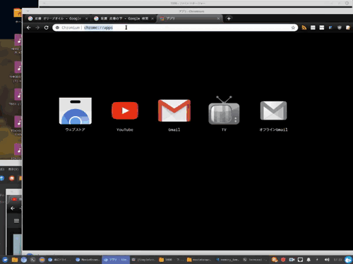

# moviebrowser
movie thumnail manager  
動画のサムネイルを見て、再生できるようにするwebアプリ  

2019-05-27  

# Dependency
Flask 1.0+ 
Bootstarp 4  
python 3.4+
- pymongo,joblib  
MongoDB 3.6+(on Docker)
ffmpeg
(Imagemagic-6)  
Linux Mint 19.1にて動作確認  

# Setup
pip3にてbootstrap,pymongo,joblibのインストール  
Dockerにてmongodを起動(port 28001)  

# Usage
python3 moviebrowser.pyと実行する。
webブラウザー上で"localhost:5000/movieにアクセスする。  
サムネイルをクリックすると動画の再生  
各項目クリックにて並び替え（降冪順）  
検索窓にてファイルの検索  
★をクリックすると星の数（最高３）を変えることができる。０にするには星の表示をクリック  
NavBarのプルダウン「更新」で、メディアファイルの更新作業  
NavBarのプルダウン「管理」で、サムネイルをクリックするとランダムでサムネイルを作成  
NavBarのプルダウン「管理」で、ファイル名をクリックするとデータを削除  
NavBarのプルダウン「データベースの変更」で、新規データベースと既存のデータベースの切り替え  
- 「動画場所選択」にて動画の場所を指定する
    - 「上位階層に移動」で親ディレクトリ
    - ディレクトリのクリックで、ディレクトリに行ける
    - 「メディア場所決定」で表示のディレクトリにて検索を行うようにする
- 「新規データベース名」に名前を付けて、「データベース作成」すると指定のディレクトリのデータベースを作成する
- データベース名にて「選択有無」をクリックすると指定のデータベースに移行できる

## 問題点  
 
- デザイン
- (ffmpegにて)再生できない動画はサムネが作成されない
- 1000までしか動画のデータベースは一度に表示できない
- 再起動時は最初に作ったデータベースを表示
  

# Licence
This software is released under the MIT License, see LICENSE.md.

# Authors
Burao Mima

# References
Bootstrap公式(https://getbootstrap.com/)  
Mongo公式(https://www.mongodb.com/jp)  
Flask公式(http://flask.pocoo.org/)  